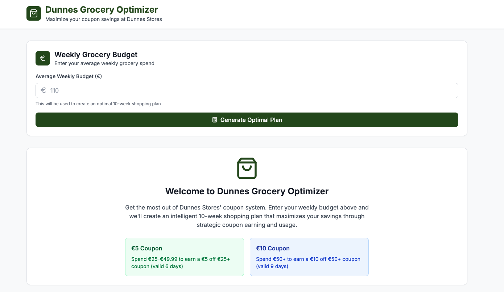
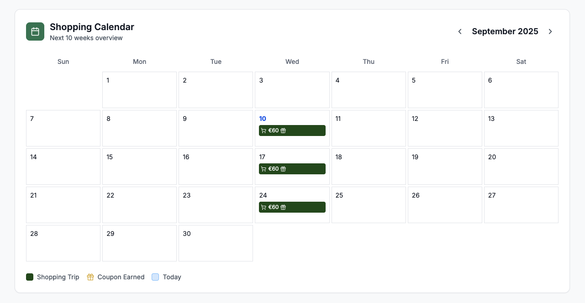
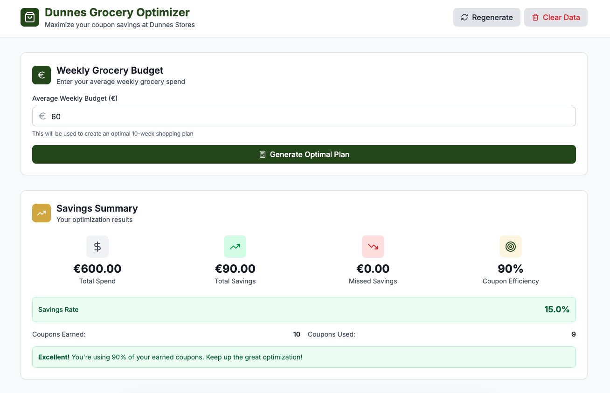

# Dunnes Shopping Optimiser

A web application that helps shoppers in Ireland optimise their **weekly grocery budget** using **Dunnes Stores’ €10 off €50 and €5 off €25 coupons**.
It automatically generates a **10-week shopping plan** that maximises coupon usage, tracks savings, and provides insights into spending efficiency.

---

## 🚀 Features

* **Weekly Budget Input** – Enter your average grocery spend and generate an optimised plan.
* **10-Week Shopping Calendar** – View all planned trips with spend breakdowns.
* **Coupon Tracking** – Monitor coupons earned, used, or expired.
* **Savings Insights** – Get a summary of total spend, savings, missed opportunities, and coupon efficiency.
* **Local Storage Support** – Saves your budget and plan so you don’t lose progress.
* **Interactive UI** – Clean, mobile-friendly design with Tailwind styling.

---

## 📸 Screenshots

### Weekly Budget Input


### Shopping Calendar


### Coupon Tracker


### Savings Summary


---

## 📂 Repository Structure

```
├── src/                              # Source code directory
│   ├── components/                   # React components
│   │   ├── BudgetInput.tsx           # Weekly budget input form
│   │   ├── CalendarView.tsx          # Calendar display (unused in current version)
│   │   ├── CouponTracker.tsx         # Coupon management component
│   │   ├── SavingsSummary.tsx        # Displays overall savings and efficiency
│   │   └── ShoppingCalendar.tsx      # Main shopping calendar with entries
│   ├── types/                        # TypeScript type definitions
│   │   └── index.ts                  # Shared types
│   ├── utils/                        # Utility functions
│   │   ├── couponRules.ts            # Coupon validation and rules
│   │   ├── optimizer.ts              # Core savings optimisation logic
│   │   └── storage.ts                # LocalStorage persistence utilities
│   ├── App.tsx                       # Main application wrapper
│   ├── index.css                     # Global styles (Tailwind)
│   ├── main.tsx                      # Application entry point
├── index.html                        # Root HTML template
├── package.json                      # Project dependencies and scripts
├── package-lock.json                 # Dependency lock file
├── postcss.config.js                 # PostCSS configuration
├── tailwind.config.js                # Tailwind CSS configuration
└── README.md                         # Project documentation
```

---

## 🛠️ Tech Stack

* **Frontend**: React + TypeScript
* **Styling**: Tailwind CSS
* **Icons**: [lucide-react](https://lucide.dev/)
* **Date Handling**: [date-fns](https://date-fns.org/)
* **State Persistence**: LocalStorage

---

## ⚙️ Installation & Setup

1. Clone the repo:

   ```bash
   git clone https://github.com/DeerghKataria/Dunnes_Shopping_Optimiser.git
   cd dunnes-shopping-optimiser
   ```

2. Install dependencies:

   ```bash
   npm install
   ```

3. Run the dev server:

   ```bash
   npm run dev
   ```

4. Open in your browser:

   ```
   http://localhost:5173
   ```

---

## 📊 How It Works

1. Enter your **average weekly grocery spend**.
2. The optimiser generates a **10-week plan** that maximises coupon usage.
3. View your plan in the **Shopping Calendar**.
4. Track your **total spend, savings, and coupon efficiency** in the **Savings Summary**.
5. Plans are **saved locally** so you don’t lose progress.
6. Under the hood, the optimiser uses a **greedy, rule-based approach** to split weekly spending around coupon thresholds (€25/€50), ensuring coupons are earned and redeemed efficiently before expiry.

---

## 🔮 Future Improvements

* Add ability to **manually log real shopping trips**.
* Support for **different coupon structures** (seasonal promotions, multiple stores).
* Export plan to **CSV/PDF** for offline use.
* Add **authentication** for syncing data across devices.

---

## 📜 License

This project is licensed under the MIT License.

---
